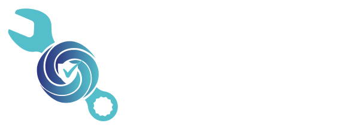

## O-RAN Deployment Manager

The **O-RAN Deployment Manager** is an automated tool for configuring and managing all components in an O-RAN/5G testbed.  
It consists of the following components:  

- Near-Real-Time RIC  
- 5G Core  
- gNodeB  
- User Equipment (UE)

>   
> The environment is **fully containerized** with Docker, ensuring consistent behavior across systems and streamlining both setup and maintenance.

The implementation was tested on the following systems:

### Features

- **Centralized configuration** of all components, including:
  - Network configuration  
  - Build type (native or Docker)  
  - Definition of multiple UEs
  - Component-specific parameters (e.g., gain rates, eSIM settings)  

- Definition of specific Endpoints
  - To log data from different endpoints within the O-RAN ecosystem
  - Attach Security 

A detailed documentation can be find in our wiki:

[CipherCellWiki](https://florianfrank.github.io/CipherCellWiki/docs/category/setup-srsran-based-test-environment)